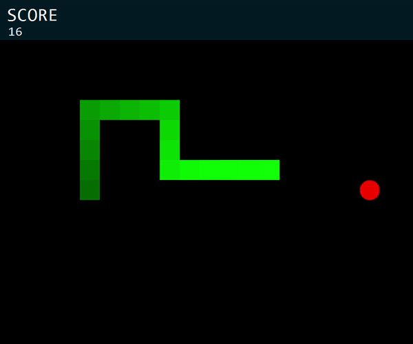

# Snake

This is a small project that I am constantly working on to get familiar with C#. It's a small clone of the classic arcade game **Snake**.

# Building

Clone the repository to your local machine and open the Visual Studio project file. From there, you can build the project and run the executable.

# How to Play

The arrow keys control the snake around the board. The `Q` key can be used to quit the game and the `P` key can be used to pause the game.

# Outstanding Issues With the Game

- The snake can still leave the board (off-screen).
- The snake can cross over itself.
- No score is displayed to the user on the screen.

